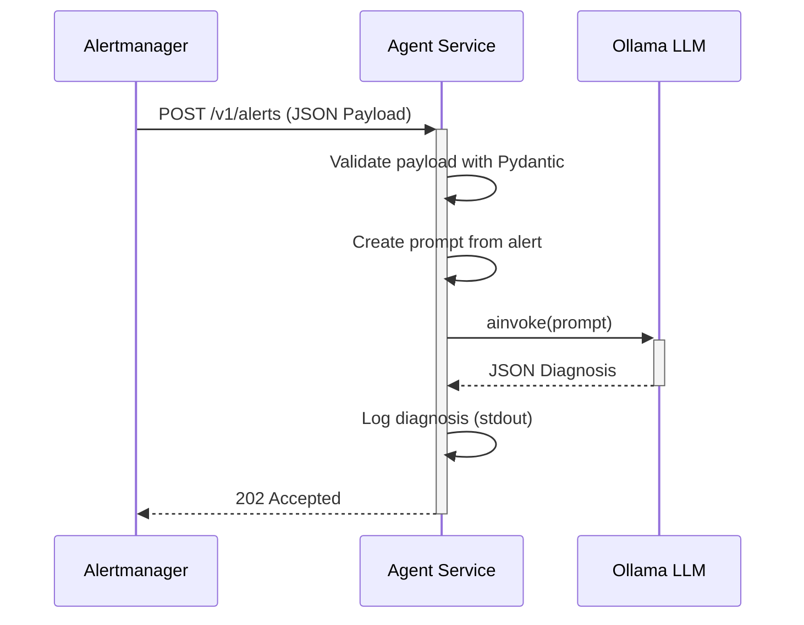

# 🏗️ Agent Service Architecture

## Role
The **Agent Service** acts as the bridge between the Observability Stack (Prometheus/Alertmanager) and the Reasoning Engine (LLM). Its primary responsibilities are to receive alerts, use an LLM to diagnose them, and log the results.

## Components

*   **`main.py`**: The FastAPI application entry point. It defines the `/v1/alerts` webhook endpoint, configures logging, and initializes the LangChain components.
*   **`schemas.py`**: Contains the Pydantic models that define the structure of the incoming Alertmanager webhook payload, ensuring data validation.
*   **`llm.py`**: Encapsulates the connection to the Ollama LLM using `OllamaLLM` from `langchain-ollama`. It provides a `get_llm` function that is pre-configured with the correct `base_url` for Docker-to-host communication.
*   **`prompts.py`**: Stores the system prompt used to instruct the LLM on how to format its diagnosis.

## Data Flow

The following diagram illustrates the data flow through the service:

## Tech Stack
- **Runtime:** Python 3.11+
- **Framework:** FastAPI (Async/High Performance)
- **Server:** Uvicorn
- **Validation:** Pydantic V2
- **LLM Integration:** LangChain, `langchain-ollama`
- **Logging:** `structlog`

## Network
- **Internal Port:** 8000